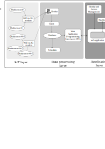

# Promet&o software repository

Public repository of the Promet&o project software developed at Politecnico di Torino.

## Description

### Software Architecture

The Promet&o architecture is based three main components components.

## Software

### Requirements

### Usage

### Contributors

- Antonio Servetti <antonio.servetti@polito.it>
- Pietro Chiavassa <pietro.chiavassa@polito.it>
- [Michele Masiello](https://github.com/Mochi009)
- [Thomas Jacques Francisco Osorio](https://github.com/tonatiu92)
- [Sara Bellatorre](https://github.com/mell0r1ne)
- Vittorio Arpino
- [Luca Errani](https://github.com/luco5826)
- [Saugo Martina](https://github.com/MartinaSaugo/)

