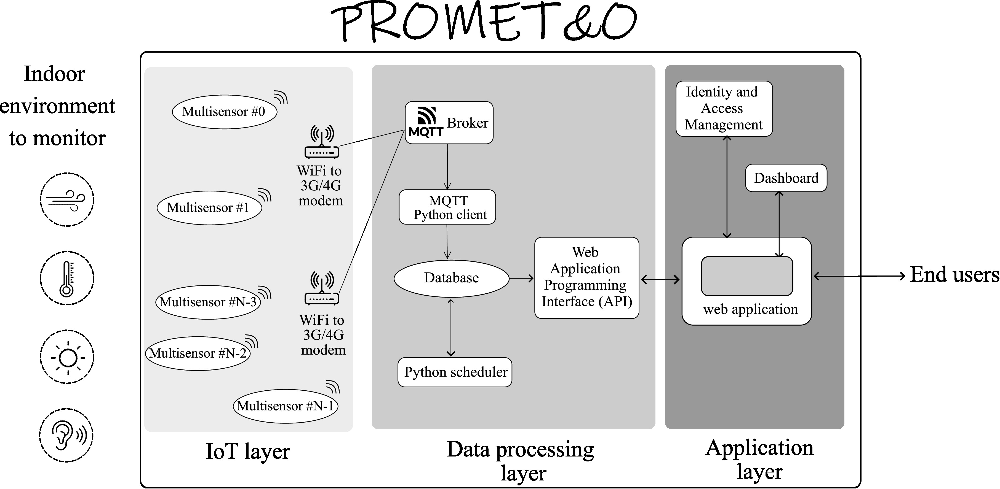

# Promet&o software repository

Software repository of the Promet&o research project developed at Politecnico di Torino by the:
- Laboratory of Applied Acoustics (LAA) and Technology Energy Building Environment (TEBE) group at the Dept. of Energy
- microEMC group at the Dept. of Electronics and Telecommunications
- Electronic CAD & Reliability group at the Dept. of Control and Computer Engineering
- Internet Media Group (IMG) at the Dept. of Control and Computer Engineering

## Software Architecture

The Promet&o architecture is based on three main software layers: the IoT layer, the data processing layer, and the application layer.

## Code Overview

This repository contains the source code of the building blocs of the Promet&o project:
- [web-app](./web-app/) contains the source code of the web application layer that comprises an ingress proxy and a React application with its own database and IAM server.
- [grafana](./grafana/) is a fork of the [Grafana repo](https://github.com/grafana/grafana) that is used by the web application and it has been customized for better interaction with embedded panels as documented in this [pull request](https://github.com/grafana/grafana/pull/86012) to the original repository.
- [WS_Backend](./WS_Backend/) is planned to house the source code for the data processing layer in the near future.

## Usage

Usage details are provided in the specific project subfolders.

## Contributors

- Antonio Servetti, email: <antonio.servetti@polito.it>
- [Pietro Chiavassa](https://github.com/ptrchv)
- [Michele Masiello](https://github.com/Mochi009)
- [Thomas Jacques Francisco Osorio](https://github.com/tonatiu92)
- [Sara Bellatorre](https://github.com/mell0r1ne)
- [Vittorio Arpino](https://github.com/victor3099/)
- [Luca Errani](https://github.com/luco5826)
- [Saugo Martina](https://github.com/MartinaSaugo/)

